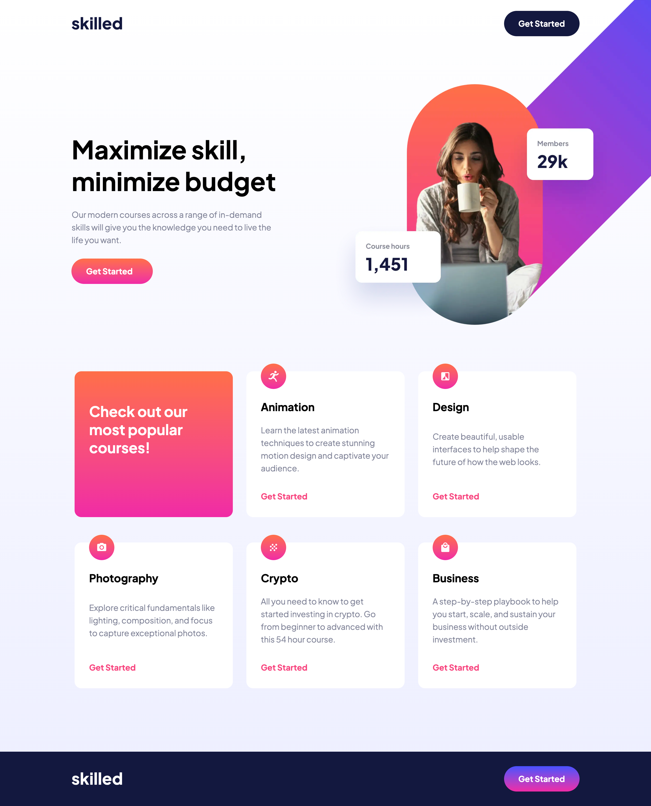
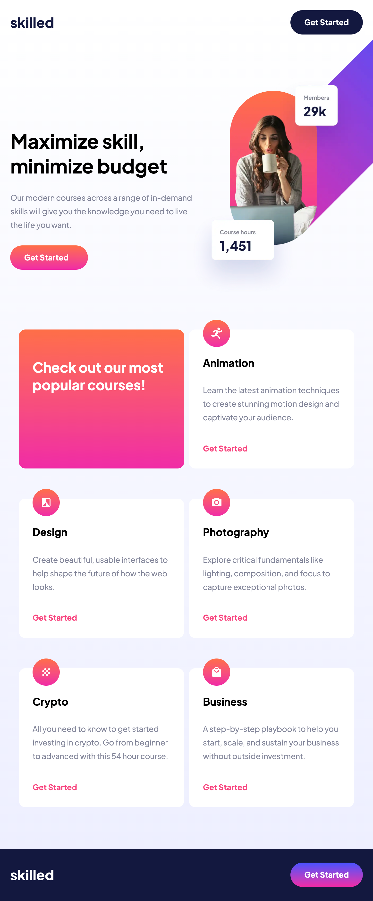
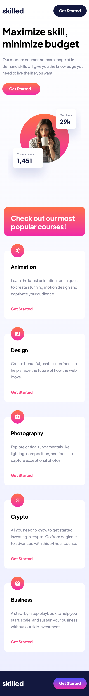
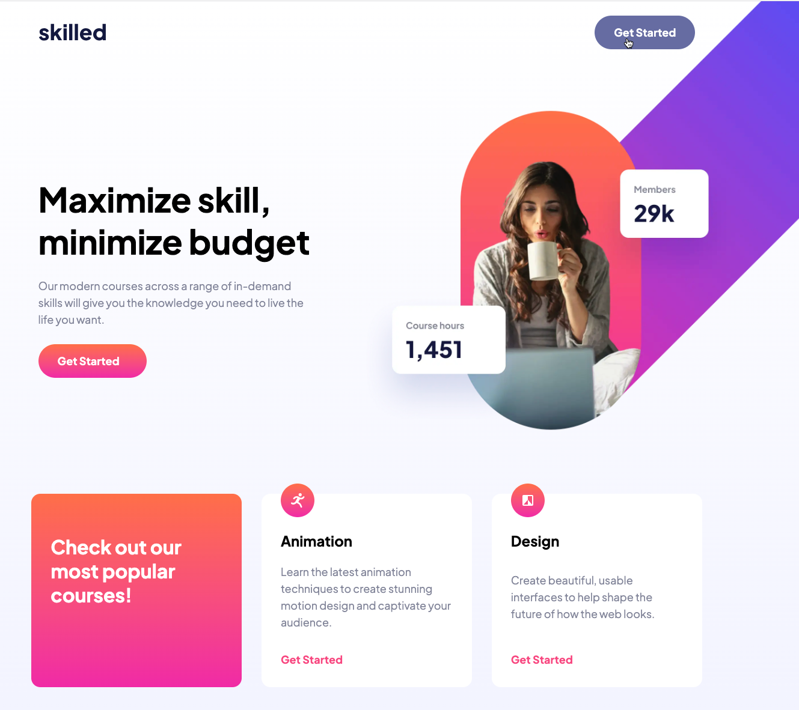

# Frontend Mentor - Skilled e-learning landing page

This is a solution to the [Skilled e-learning landing page challenge on Frontend Mentor](https://www.frontendmentor.io/challenges/skilled-elearning-landing-page-S1ObDrZ8q). 

## The challenge

The challenge is to build out this landing page and get it looking as close to the design as possible.

Your users should be able to:

- View the optimal layout depending on their device's screen size
- See hover states for interactive elements

## Where to find everything

All the required assets for this project are in the `/assets` folder. The assets are already exported for the correct screen size and optimized. Some images are reusable at multiple screen sizes, some are for specific layouts. We also include WEBP and PNG versions and different resolutions of the hero image, so you can choose to use whichever format and resolution you like or even look into letting the browser choose which image to use based on specific conditions.

### Screenshots

#### Desktop

  

#### Tablet

  

#### Mobile:

  

#### Active state

  

### Built with

- Semantic HTML5 markup
- CSS custom properties
- Flex
- Media queries
- Visual Studio Code
